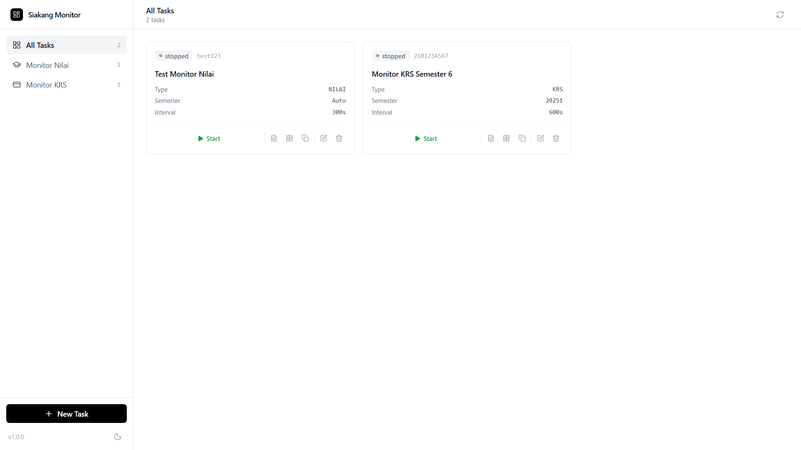
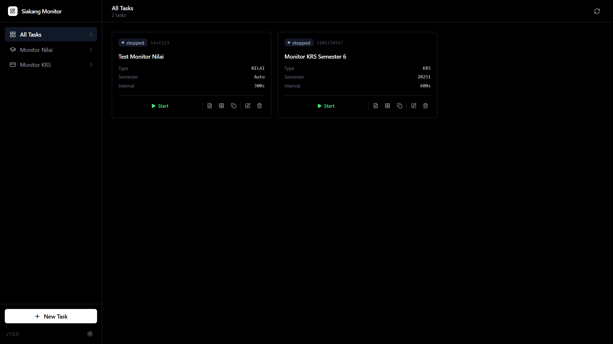

# Monitoring Akademik Siakang

<br>

<div align="center">
   
   <br><br>
   
</div>

<br>

A robust and modern web-based academic monitoring application for **Siakang Untirta**. Track academic activities in real-time with multi-channel notifications to **Telegram** & **WhatsApp** through an interactive dashboard.

## Tech Stack

- **Frontend**: Vue 3 + Vite + Tailwind CSS + shadcn-vue (Radix Vue)
- **Backend**: FastAPI + SQLite + BeautifulSoup4 + Playwright
- **Notifications**: Telegram Bot API & WhatsApp (WAHA)

## Key Features

- **Dual Monitoring Mode**:
  - **Grade Monitor**: Track new grades, grade changes, GPA, and cumulative GPA.
  - **KRS Monitor**: Track course availability during the KRS period (Livewire Support).

## Additional Features

- **PIN Authentication**: Simple 4-digit PIN to secure dashboard access.
- **Responsive Design**: Sidebar layout with full support for mobile, tablet, and desktop.
- **Dark Mode**: Dark theme support with toggle.
- **Modern Web Dashboard**: Vue.js interface with shadcn-vue components.
- **Multi-Channel Notifications**: Supports **Telegram Bot** and **WhatsApp** (via WAHA) for instant notifications.
- **Per-Course Notifications**: Get notified individually when each course grade is released, even before all grades are out.
- **Multi-Account & Group Support**: Monitor multiple accounts simultaneously. WA notifications can be sent to **WhatsApp Groups**.
- **Smart Reordering**: Arrange monitoring priority with intelligent drag & drop per category.
- **One-Click Clone**: Duplicate task configurations for quick setup.
- **Visual Data Viewer**:
  - **Grades**: View temporary transcript, quality points, credits in a clean table.
  - **KRS**: Color indicators (Green/Red) for target course status (Found/Missing).
- **Full Control**: Start/Stop monitoring, view Live Logs, clear Logs, and Reset scraped data directly from the UI.
- **Docker Ready**: Easy deployment with full environment isolation.

## Installation & Usage

### Option 1: Using Docker (Recommended)

**Clone the Repository**

```bash
git clone https://github.com/mohfer/monitoring-akademik-siakang
cd monitoring-akademik-siakang
```

**Set Up Environment Variables**

Copy `.env.example` to `.env`:

```bash
cp .env.example .env
```

Configure the following variables:

- `TELEGRAM_TOKEN`: Your Telegram bot token (optional).
- `WAHA_BASE_URL`: WAHA server URL (optional, for WhatsApp). **WAHA is an external service** that needs to be set up separately. See [WAHA documentation](https://waha.devlike.pro/) for installation.
- `WAHA_SESSION`: WAHA session name (default: `default`).
- `WAHA_API_KEY`: WAHA API key if your server uses authentication.
- `APP_PIN`: 4-digit PIN to access the dashboard (default: `1234`). Change this for security.
- `FRONTEND_PORT`: Frontend port (default: `3000`).
- `BACKEND_PORT`: Backend port (default: `8000`).

**Note**: At least one of `TELEGRAM_TOKEN` or `WAHA_BASE_URL` must be configured to receive notifications.

**Run the Application**

```bash
docker compose up -d --build
```

Access the dashboard at: `http://localhost:3000`

### Option 2: Manual Installation (Developer)

**Prerequisites:** [uv](https://docs.astral.sh/uv/), Node.js 20+ (uv will manage Python 3.10+ automatically)

**Backend Setup**

Copy `.env.example` to `.env` and configure it.

```bash
cp .env.example .env
uv sync
uv run playwright install chromium   # browser to bypass Cloudflare
uv run uvicorn server.main:app --reload --port 8000
```

> **Note:** The scraper uses Chromium (Playwright) to bypass Siakang's Cloudflare
> protection. It runs headless on the server without a display. Each active
> monitoring task launches its own Chromium instance (~150-300MB RAM), so
> consider server capacity when running multiple tasks.
> In Docker, the browser is already included in the image, so `playwright install`
> does not need to be run manually.

**Frontend Setup**

```bash
cd frontend
pnpm install
pnpm run dev
```

## Usage Guide

### First Access

1. Open the dashboard at `http://localhost:3000`.
2. You will be prompted to enter a **4-digit PIN**.
3. Enter the PIN configured in `.env` (default: `1234`).
4. You will stay logged in until you click the **Logout** button.

### Creating a New Monitor

1. Click **"+ New Task"**.
2. Select Type: **Grades** or **KRS (Plans)**.
3. Enter your **Login ID** (NIM) & **Password** for Siakang.
4. **Notifications**:
   - Fill in **Telegram Chat ID** for personal Telegram notifications.
   - Fill in **WhatsApp Number** (e.g., `62812xxx`) or **Group ID** (e.g., `123...@g.us`) for WA notifications.
   - _Tip: Check your **Group ID** in the [WAHA Documentation](https://waha.devlike.pro/swagger/#/%F0%9F%91%A5%20Groups/GroupsController_getGroups)._
5. **Configuration**:
   - **Grades Mode**: Click "Fetch" Semesters and select the active semester.
   - **KRS Mode**: Enter target course names (one per line) in the "Target Courses" column.
6. Save & click **Start**.

### Other Features

- **Clear Logs**: Click the trash icon in the Logs modal to clear old logs.
- **Reset Data**: Click the reset icon in the Data modal to clear scraped data cache so notifications can trigger again when new data arrives.

## Disclaimer

This application uses Playwright (headless Chromium) for automated browser interaction with the Siakang Untirta website. Since Siakang is protected by Cloudflare anti-bot challenges, traditional HTTP-based scraping no longer works. Playwright executes a real browser instance to handle JavaScript challenges and scrape data. Changes to the Siakang website may affect functionality. Use reasonable monitoring intervals (default 300s) to avoid overloading the campus server.
